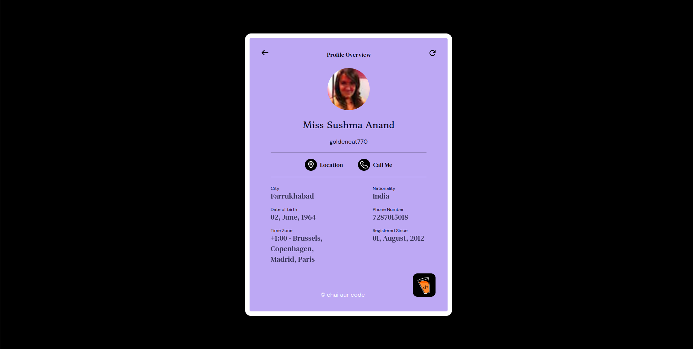
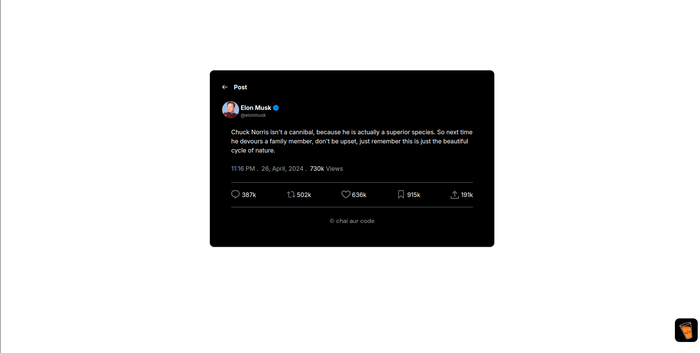
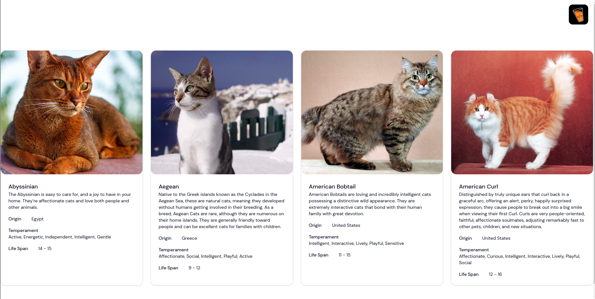

# Master JI Assignment

This Assignment includes 3 Tasks:
- Random User Profile
- Random Jokes Tweet
- Cats Listing

### All 3 task are listing on different routes which are:
- "/random-user" - for Random user
- "/random-jokes" - for Random Jokes
- "/cats-listing" - for Cat Listing Page

### Here are the Images

# Task 1

# Task 2

# Task 3
 

### live site deployed link
 [click here](https://main--ankush-assignment.netlify.app/)
